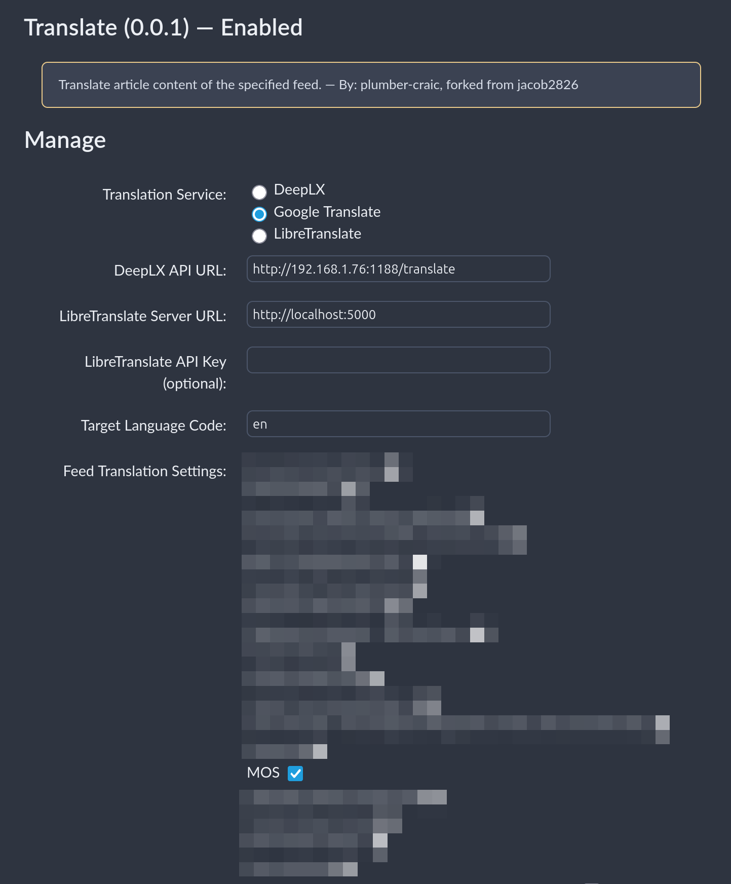

# Translate

`Translate` is a plugin for [FreshRSS](https://github.com/FreshRSS/FreshRSS) that translates feed titles and content to your chosen target language. Users can select from DeeplX, Google Translate, or LibreTranslate services.

This is a fork of [jacob2826's TranslateTitlesCN](https://github.com/jacob2826/FreshRSS-TranslateTitlesCN), enhanced with the following features:
- **Target language selection** - Translate to any language, not just Chinese
- **Content translation** - Translate article content in addition to titles
- **LibreTranslate support** - Added support for the open-source LibreTranslate service
- **Auto-refresh fix** - Fixed translation issues during automatic feed refresh

## Screenshots

## Installation

1. Download the `Translate` plugin
2. Place the `xTranslate` folder in your FreshRSS instance's `./extensions` directory
3. Log in to your FreshRSS instance
4. Navigate to the Extensions section in the admin panel
5. Find `Translate` in the plugin list and click "Enable"

## Usage

After installation and activation, go to the plugin's configuration page to set up:

### Translation Service Selection

Choose from three translation providers:

- **DeeplX**: 
  - Deploy your own [DeeplX](https://github.com/OwO-Network/DeepLX/) instance
  - Default API address: `http://localhost:1188/translate`
  - Or use public DeeplX services like `https://api.deeplx.fun/translate`

- **Google Translate**: 
  - No additional configuration required
  - Uses Google's free translation API

- **LibreTranslate**: 
  - Deploy your own [LibreTranslate](https://github.com/LibreTranslate/LibreTranslate) instance for offline translation
  - Or use public instances (see [LibreTranslate Mirrors](https://github.com/LibreTranslate/LibreTranslate#mirrors))
  - Configure the server address (e.g., `https://libretranslate.com/`)
  - Add API key if required by your instance

### Configuration Options

- **Target Language**: Select your desired target language for translations
- **Per-Feed Translation**: Enable/disable title translation for each feed individually
- **Content Translation**: Enable/disable content translation for each feed individually

## Notes

- When using DeeplX, ensure your instance is properly deployed and the API address is correct
- Use translation services responsibly to avoid rate limiting or IP bans
- This plugin is specifically designed for FreshRSS - ensure compatibility with your version

## Contributing

Contributions are welcome! Please submit Pull Requests or Issues through the GitHub repository.

## License

This project is licensed under the [GNU General Public License v3.0](https://www.gnu.org/licenses/gpl-3.0.en.html).

## Credits

- Original project: [jacob2826/FreshRSS-TranslateTitlesCN](https://github.com/jacob2826/FreshRSS-TranslateTitlesCN)
